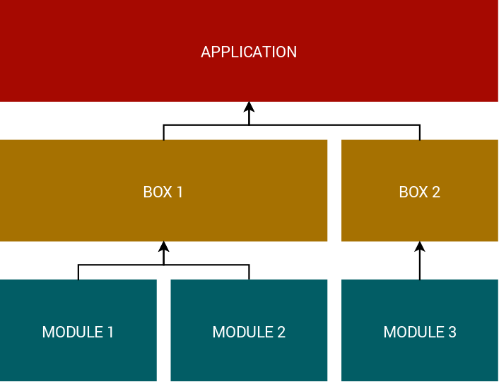

# Concord Overview

## Modules

Modules are the de-coupled implementations of the business logic and they have to comply with Concord's basic rules in order to be able to cooperate as a unified application.

## Boxes

Boxes are optional. Think of them as "boilerplate" applications.
They are subject to customization by the Application.

## Application

Any Laravel 5.3+ application can be a Concord compliant application that
complies with its rules.

The application defines it's own logic and incorporates Concord
modules and/or boxes.

### Simple Layout (Modules Only)

### Multi-box Layout

#### Next: [Modules &raquo;](modules.md)